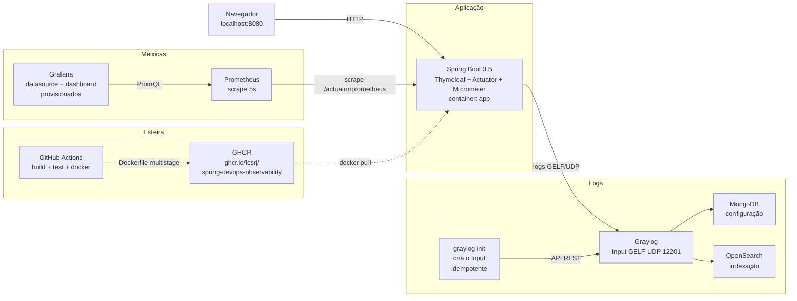

# DevOps Observability Control Center

[](https://github.com/lcsrj/spring-devops-observability/actions/workflows/ci-cd.yml)
[](https://adoptium.net/)
[](https://spring.io/projects/spring-boot)
[](Dockerfile)
[](https://github.com/lcsrj/spring-devops-observability/pkgs/container/spring-devops-observability)

Projeto prático de **Automação, Observabilidade e esteira DevSecOps** construído sobre uma
aplicação **Java 21 / Spring Boot 3.5**, com interface web própria, imagem Docker
**multistage**, pipeline CI/CD no GitHub Actions com publicação no GHCR, métricas no
Prometheus, dashboard provisionado no Grafana e centralização de logs no Graylog.

A stack completa sobe com **um único comando**:

```bash
docker compose up --build
```

---

## Sumário

- [1. Visão geral](#1-visão-geral)
- [2. Arquitetura](#2-arquitetura)
- [3. Como executar](#3-como-executar)
- [4. URLs da stack](#4-urls-da-stack)
- [5. Credenciais locais de laboratório](#5-credenciais-locais-de-laboratório)
- [6. Como gerar tráfego e logs](#6-como-gerar-tráfego-e-logs)
- [7. Como validar o Prometheus](#7-como-validar-o-prometheus)
- [8. Como validar o Grafana](#8-como-validar-o-grafana)
- [9. Como validar o Graylog](#9-como-validar-o-graylog)
- [10. Scripts de validação](#10-scripts-de-validação)
- [11. Testes automatizados](#11-testes-automatizados)
- [12. Multistage Build](#12-multistage-build)
- [13. Pipeline CI/CD](#13-pipeline-cicd)
- [14. Imagem no GHCR](#14-imagem-no-ghcr)
- [15. Endpoints da aplicação](#15-endpoints-da-aplicação)
- [16. Estrutura do projeto](#16-estrutura-do-projeto)
- [17. Decisões técnicas](#17-decisões-técnicas)
- [18. Versões utilizadas](#18-versões-utilizadas)
- [19. Troubleshooting](#19-troubleshooting)
- [20. Evidências](#20-evidências)

---

## 1. Visão geral

### Objetivo

Demonstrar, de ponta a ponta e de forma reproduzível, uma esteira DevOps/DevSecOps completa:

| Pilar | O que o projeto entrega |
|---|---|
| **Aplicação** | API + **interface web** servida pelo próprio Spring Boot (Thymeleaf, CSS e JS próprios, sem CDN) |
| **Automação de build** | `Dockerfile` **multistage** (JDK+Maven para build e testes → JRE enxuto para runtime) |
| **CI/CD** | GitHub Actions: compila, testa, constrói a imagem e publica no GitHub Container Registry |
| **Métricas** | Spring Boot Actuator + Micrometer expostos em `/actuator/prometheus`, coletados pelo Prometheus |
| **Visualização** | Grafana com data source e dashboard **provisionados automaticamente** |
| **Logs** | Logback + appender **GELF** enviando para o Graylog (MongoDB + OpenSearch), com Input criado automaticamente |
| **Segurança** | Usuário não-root na imagem, superfície mínima do Actuator, varreduras Trivy na pipeline |

### O que a interface faz

A página inicial (`http://localhost:8080`) é um painel de demonstração que:

- mostra **status, uptime, versão, ambiente, heap da JVM e threads** lidos de `/api/status`;
- dispara **requisições HTTP reais** contra o backend (200 / 400 / 500 e rajadas);
- emite **logs reais** nos níveis DEBUG / INFO / WARN / ERROR, que chegam ao Graylog;
- exibe o **histórico das últimas ações**, com status e duração **medidos no servidor**;
- informa se o **envio de logs ao Graylog está realmente ativo** (verificação do appender no
  Logback, não um texto fixo).

Nada é simulado no navegador: toda ação do painel atravessa o backend Spring.

### Tecnologias

`Java 21` · `Spring Boot 3.5.3` · `Maven` · `Spring Web` · `Spring Boot Actuator` ·
`Micrometer Prometheus` · `Thymeleaf` · `HTML5` · `CSS próprio` · `JavaScript puro` ·
`JUnit 5` · `MockMvc` · `AssertJ` · `Logback` · `logback-gelf` · `Docker` ·
`Docker Compose` · `Prometheus` · `Grafana` · `Graylog` · `MongoDB` · `OpenSearch` ·
`GitHub Actions` · `GitHub Container Registry` · `Trivy`

---

## 2. Arquitetura



### Fluxo de dados

1. O navegador chama a aplicação; cada requisição recebe um **correlation id**.
2. O Micrometer registra a requisição em `http_server_requests_seconds` com as tags
   `status`, `uri`, `method`, `outcome` e as tags comuns `application`, `environment`, `version`.
3. O Prometheus faz scrape de `app:8080/actuator/prometheus` a cada 5 segundos.
4. O Grafana consulta o Prometheus e desenha o dashboard provisionado.
5. O Logback envia cada evento de log por **GELF/UDP** para o Graylog, que grava a
   configuração no MongoDB e indexa as mensagens no OpenSearch.
6. O serviço `graylog-init` cria o Input GELF pela API do Graylog na subida da stack.

### Ciclo de vida de uma requisição

O caminho de uma única chamada a `GET /api/demo/error`, na ordem em que o código executa:

| Ordem | Componente | O que acontece |
|---|---|---|
| 1 | `CorrelationIdFilter` | Lê o header `X-Correlation-Id` ou gera um novo. Coloca no **MDC** do Logback e no header da resposta. Todo log emitido a partir daqui carrega esse id. |
| 2 | `ActionAuditInterceptor` (`preHandle`) | Marca o instante inicial. Só atua em `/api/demo/**`, então o polling de `/api/status` não polui o histórico. |
| 3 | `DemoController` | Executa a ação pedida — aqui, lança a exceção que produz o 500. |
| 4 | `ApiExceptionHandler` | Traduz a exceção em resposta HTTP real (400 ou 500) e emite o log `WARN`/`ERROR` **com o stack trace**. |
| 5 | `ActionAuditInterceptor` (`afterCompletion`) | Calcula a duração, lê o status final e grava no `ActionHistoryService`. Status e duração são medidos **no servidor**, não no navegador. |
| 6 | Micrometer (automático) | Incrementa `http_server_requests_seconds` com as tags `status`, `uri`, `method`, `outcome`, somadas às tags comuns `application`/`environment`/`version` do `MetricsConfig`. |
| 7 | Logback → GELF | O appender assíncrono despacha o evento por UDP para o Graylog, com `correlation_id` e os demais campos. |
| 8 | Prometheus | No próximo scrape (5s), coleta a série já atualizada em `/actuator/prometheus`. |
| 9 | Grafana | O painel correspondente reflete a mudança na consulta seguinte. |

Ou seja: **uma requisição produz simultaneamente uma métrica e um log correlacionado**, e os
dois chegam a ferramentas distintas sem nenhum passo manual. O `correlation_id` é o que
permite sair de um pico no gráfico do Grafana e achar a mensagem exata no Graylog.

### Ordem de inicialização (`depends_on` + healthchecks)

```text
mongodb (healthy) ─┐
                   ├─> graylog (started) ─> app (healthy) ─> prometheus (healthy) ─> grafana
opensearch (healthy)┘
                     graylog (healthy) ─> graylog-init (exit 0)
```

---

## 3. Como executar

### Pré-requisitos

- Docker Engine com Docker Compose v2 (`docker compose version`)
- Aproximadamente 4 GB de RAM disponíveis para os containers
- Portas livres no host: `8080`, `9090`, `3000`, `9000`, `12201/udp`

> **Não é necessário ter Java ou Maven instalados.** A compilação e os testes rodam dentro
> do estágio de build da imagem Docker.

### Comando principal

```bash
docker compose up --build
```

É isso. Não há nenhum passo manual depois: o Prometheus já aponta para a aplicação, o
Grafana já tem data source e dashboard, e o Input GELF do Graylog é criado
automaticamente pelo serviço `graylog-init`.

Para rodar em background:

```bash
docker compose up --build -d
```

A primeira execução leva alguns minutos (download das imagens + build Maven). A stack
está pronta quando todos os serviços aparecem `healthy`:

```bash
docker compose ps
```

```text
SERVICE        STATUS                    PORTS
app            Up (healthy)              0.0.0.0:8080->8080/tcp
grafana        Up (healthy)              0.0.0.0:3000->3000/tcp
graylog        Up (healthy)              0.0.0.0:9000->9000/tcp, 0.0.0.0:12201->12201/udp
graylog-init   Exited (0)
mongodb        Up (healthy)              27017/tcp
opensearch     Up (healthy)              9200/tcp, 9300/tcp
prometheus     Up (healthy)              0.0.0.0:9090->9090/tcp
```

`graylog-init` **deve** aparecer como `Exited (0)`: é um job de execução única que termina
após provisionar o Input GELF.

Ou espere de forma programática:

```bash
./scripts/wait-stack.sh
```

### Encerrar

```bash
docker compose down            # remove os containers, preserva os volumes
docker compose down -v         # remove também os volumes (reset completo)
```

### Trocar portas ocupadas

Todas as portas publicadas são parametrizáveis. Se alguma já estiver em uso na sua
máquina, copie o `.env.example` e ajuste apenas o necessário:

```bash
cp .env.example .env
# edite, por exemplo: GRAFANA_PORT=3001
docker compose up --build -d
```

Os scripts de validação leem o mesmo `.env`, portanto continuam funcionando com as
portas alteradas.

---

## 4. URLs da stack

| Serviço | URL | Observação |
|---|---|---|
| **Aplicação (painel)** | http://localhost:8080 | interface web do projeto |
| Actuator health | http://localhost:8080/actuator/health | usado pelo healthcheck do Compose |
| Actuator info | http://localhost:8080/actuator/info | nome, versão e ambiente |
| Métricas Prometheus | http://localhost:8080/actuator/prometheus | formato de scrape do Micrometer |
| **Prometheus** | http://localhost:9090 | targets em *Status → Targets* |
| **Grafana** | http://localhost:3000 | abre direto no dashboard do projeto |
| **Graylog** | http://localhost:9000 | busca de logs em *Search* |
| Input GELF | `udp://localhost:12201` | destino dos logs da aplicação |

MongoDB (`27017`) e OpenSearch (`9200`) **não** são publicados no host: são dependências
internas do Graylog e ficam acessíveis apenas na rede Docker `observability-net`.

---

## 5. Credenciais locais de laboratório

> ⚠️ **Credenciais de DESENVOLVIMENTO.** Valores default reprodutíveis, definidos apenas
> para este laboratório local. **Não reutilizar em produção.** Nenhum token do GitHub, PAT
> ou segredo real está versionado neste repositório.

| Serviço | Usuário | Senha |
|---|---|---|
| **Grafana** | `admin` | `admin123` |
| **Graylog** | `admin` | `admin` |

Para alterar, copie `.env.example` para `.env` (que está no `.gitignore`) e ajuste:

- `GRAFANA_ADMIN_USER` / `GRAFANA_ADMIN_PASSWORD`
- `GRAYLOG_ADMIN_PASSWORD` (texto puro, usado pelo `graylog-init`)
- `GRAYLOG_ROOT_PASSWORD_SHA2` (SHA-256 da mesma senha, usado pelo Graylog)
- `GRAYLOG_PASSWORD_SECRET` (mínimo 16 caracteres)

Gerando um novo hash do Graylog:

```bash
echo -n 'suaNovaSenha' | sha256sum
```

---

## 6. Como gerar tráfego e logs

### Pela interface (recomendado para a demonstração)

Acesse http://localhost:8080 e use:

**Seção "Gerar tráfego"**

| Botão | Efeito real |
|---|---|
| `200 OK` | `GET /api/demo/ok` → HTTP 200 |
| `400 Bad Request` | `GET /api/demo/bad-request` → HTTP 400 |
| `500 Server Error` | `GET /api/demo/error` → HTTP 500 |
| `Disparar rajada` | `POST /api/demo/traffic` → o **backend** dispara N requisições reais contra si mesmo, misturando 2xx / 4xx / 5xx (limite de 200) |

**Seção "Gerar logs"**

Os botões `DEBUG`, `INFO`, `WARN` e `ERROR` fazem o backend emitir um evento de log real
em cada nível, com `correlation_id` no MDC. O botão `ERROR` inclui uma exceção com stack
trace completo.

Cada ação atualiza os cards de estado e a tabela **Histórico recente**, com status e
duração medidos no servidor.

### Pelo script

```bash
./scripts/generate-traffic.sh        # 3 rodadas (default)
./scripts/generate-traffic.sh 10     # 10 rodadas
```

O script garante tráfego nas três famílias de status e emite os quatro níveis de log,
retornando exit code diferente de zero se algum status vier diferente do esperado.

### Por linha de comando

```bash
curl -i http://localhost:8080/api/demo/ok
curl -i http://localhost:8080/api/demo/bad-request
curl -i http://localhost:8080/api/demo/error
curl -i -X POST http://localhost:8080/api/demo/log/error
curl -i -X POST -H 'Content-Type: application/json' \
     -d '{"requests": 50}' http://localhost:8080/api/demo/traffic
```

---

## 7. Como validar o Prometheus

### 1. O endpoint da aplicação responde

```bash
curl -s http://localhost:8080/actuator/prometheus | grep -E 'jvm_memory_used_bytes|http_server_requests_seconds_count' | head
```

### 2. O target está `UP`

Abra **http://localhost:9090/targets** e confirme que o job `spring-boot-app`
(`http://app:8080/actuator/prometheus`) está **UP**.

Pela API:

```bash
curl -s 'http://localhost:9090/api/v1/targets?state=active' | grep -o '"health":"[a-z]*"'
```

Ou diretamente em PromQL (`1` = coletando):

```promql
up{job="spring-boot-app"}
```

### 3. As métricas exigidas existem com dados reais

Cole no campo de consulta do Prometheus (http://localhost:9090/graph):

| Métrica exigida | PromQL validado |
|---|---|
| Memória Heap da JVM | `sum(jvm_memory_used_bytes{job="spring-boot-app",area="heap"})` |
| Heap máxima / comprometida | `sum(jvm_memory_max_bytes{job="spring-boot-app",area="heap"})` |
| CPU do processo | `process_cpu_usage{job="spring-boot-app"}` |
| Requisições por segundo (RPS) | `sum(rate(http_server_requests_seconds_count{job="spring-boot-app"}[1m]))` |
| Requisições por status HTTP | `sum by (status) (http_server_requests_seconds_count{job="spring-boot-app"})` |
| Separação 2xx / 4xx / 5xx | `sum(rate(http_server_requests_seconds_count{job="spring-boot-app",status=~"5.."}[1m]))` |
| Tempo de resposta médio | `sum(rate(http_server_requests_seconds_sum[1m])) / sum(rate(http_server_requests_seconds_count[1m]))` |
| Percentil p95 de latência | `histogram_quantile(0.95, sum by (le) (rate(http_server_requests_seconds_bucket{job="spring-boot-app"}[5m])))` |
| Threads da JVM | `jvm_threads_live_threads{job="spring-boot-app"}` |
| Uptime | `process_uptime_seconds{job="spring-boot-app"}` |
| Eventos de log por nível | `sum by (level) (app_demo_log_events_total{job="spring-boot-app"})` |

Se algum gráfico estiver vazio, gere tráfego primeiro (seção 6): as séries HTTP só existem
depois da primeira requisição.

---

## 8. Como validar o Grafana

O Grafana é **totalmente provisionado**: nada precisa ser cadastrado pela interface.

1. Acesse http://localhost:3000 e entre com `admin` / `admin123`.
2. O Grafana abre **direto** no dashboard **`Spring Boot — Application Observability`**
   (configurado como home dashboard). Ele também está em
   *Dashboards → Spring Boot*.
3. Confirme em *Connections → Data sources* que **Prometheus** já existe, apontando para
   `http://prometheus:9090`.

### Painéis do dashboard

| Linha | Painéis |
|---|---|
| **Visão geral** | Status geral da aplicação (UP/DOWN) · Uptime · Total de requisições HTTP · RPS · Latência média · Threads da JVM |
| **Requisições HTTP** | RPS separado por família 2xx / 4xx / 5xx · Distribuição por status HTTP (donut) · Tempo de resposta (média, p95, p99) · Requisições por endpoint |
| **JVM e processo** | Heap usada / comprometida / máxima · CPU do processo e do sistema · Threads e memória não-heap · Eventos de log por nível |

### Para os gráficos saírem preenchidos

Gere tráfego antes ou durante a visualização:

```bash
./scripts/generate-traffic.sh 5
```

Depois selecione o intervalo **Last 15 minutes** com refresh de 10s. Os dados são reais:
vêm do Prometheus, que coleta a aplicação de verdade.

---

## 9. Como validar o Graylog

### O Input já está criado

O serviço `graylog-init` cria o Input **GELF UDP 12201** na subida da stack. Confira:

```bash
docker compose logs graylog-init
```

```text
[graylog-init] Graylog saudavel apos 0s (lbstatus=ALIVE)
[graylog-init] criando input 'GELF UDP - Spring Boot' (GELF UDP na porta 12201)...
[graylog-init] input criado com sucesso (HTTP 201)
[graylog-init] OK: input GELF UDP 12201 esta RUNNING e pronto para receber logs
```

Na interface: *System → Inputs* mostra **GELF UDP - Spring Boot** como `RUNNING`.

O script é **idempotente**: em uma segunda subida ele detecta o Input existente e não
duplica nada.

### Pesquisando os logs

1. Acesse http://localhost:9000 e entre com `admin` / `admin`.
2. Vá em **Search** e ajuste o intervalo para *Search in the last 1 hour*.
3. Use as consultas abaixo:

| O que validar | Consulta |
|---|---|
| Todos os logs da aplicação | `application:spring-devops-observability` |
| Apenas ERROR | `application:spring-devops-observability AND level_name:ERROR` |
| Apenas WARN | `application:spring-devops-observability AND level_name:WARN` |
| Apenas INFO | `application:spring-devops-observability AND level_name:INFO` |
| Apenas DEBUG | `application:spring-devops-observability AND level_name:DEBUG` |
| Por ambiente | `environment:docker` |
| Por versão | `version:1.0.0` |
| Rastrear uma requisição | `correlation_id:"<id retornado no header X-Correlation-Id>"` |

> Se não houver resultados, clique nos botões de log no painel
> (http://localhost:8080) e refaça a busca: as mensagens aparecem em poucos segundos.

### Campos disponíveis em cada mensagem

O appender GELF envia dados estruturados, não apenas texto:

| Campo | Exemplo |
|---|---|
| `timestamp` | `2026-09-17T16:18:03.838Z` |
| `level_name` | `ERROR` |
| `level` | `3` (severidade syslog) |
| `logger_name` | `br.com.devops.observability.demo.LogGenerator` |
| `message` | `[demo-error] requisitado via painel ... ` |
| `full_message` | mensagem + stack trace completo |
| `application` | `spring-devops-observability` |
| `environment` | `docker` |
| `version` | `1.0.0` |
| `correlation_id` | `bdb19ff9-56dc-4722-b931-8de62bd5ccaa` |
| `thread_name` | `http-nio-8080-exec-5` |
| `source` | `spring-app` |
| `root_cause_class_name` | `java.lang.IllegalStateException` |

Pela API (útil para automação):

```bash
curl -s -u admin:admin -H 'X-Requested-By: cli' \
  --get --data-urlencode 'query=application:spring-devops-observability AND level_name:ERROR' \
  --data-urlencode 'range=900' \
  http://localhost:9000/api/search/universal/relative
```

---

## 10. Scripts de validação

Todos retornam **exit code diferente de zero** quando alguma verificação falha, e
respeitam as portas definidas no `.env`.

| Script | O que faz |
|---|---|
| `./scripts/wait-stack.sh [timeout]` | Espera todos os containers ficarem `healthy`, o `graylog-init` terminar com exit 0 e os endpoints HTTP responderem. Usa readiness real, sem `sleep` cego. |
| `./scripts/generate-traffic.sh [rodadas]` | Gera tráfego 2xx / 4xx / 5xx e emite logs nos quatro níveis. |
| `./scripts/smoke-test.sh` | 28 verificações: aplicação, interface, actuator, endpoint Prometheus da app, Prometheus, Grafana e Graylog. |
| `./scripts/verify-stack.sh` | Auditoria completa (83 verificações): arquivos obrigatórios, multistage real, inspeção da imagem, containers healthy, endpoints, target UP e métricas com valor, Grafana provisionado e devolvendo dados, Input GELF RUNNING, logs dos 4 níveis pesquisáveis e `mvn test`. |
| `./scripts/capture-evidence.sh` | Gera as evidências de `docs/evidencias/`: capturas de tela com Chromium headless em container (nada a instalar) e saídas reais de comandos e de API. |
| `./scripts/lib.sh` | Funções compartilhadas (não é executado diretamente). |

Sequência recomendada para uma validação limpa:

```bash
docker compose down -v
docker compose up --build -d
./scripts/wait-stack.sh
./scripts/smoke-test.sh
./scripts/generate-traffic.sh 3
./scripts/verify-stack.sh
./scripts/capture-evidence.sh   # opcional: regenera docs/evidencias/
```

Opções úteis do `verify-stack.sh`:

```bash
./scripts/verify-stack.sh --skip-tests    # não roda mvn test
./scripts/verify-stack.sh --skip-image    # não inspeciona a imagem Docker
```

---

## 11. Testes automatizados

**23 testes** cobrindo:

| Classe | Cobertura |
|---|---|
| `ObservabilityApplicationTests` | O contexto do Spring inicializa; beans principais registrados; propriedades carregadas (inclusive a versão filtrada pelo Maven) |
| `StatusEndpointTests` | `GET /` entrega a interface; `/api/status`; propagação do correlation id; `/actuator/health` (e a garantia de que ele **nao** depende de espaco em disco do host); `/actuator/info`; `/actuator/prometheus` com métricas de JVM, CPU, threads, uptime e HTTP; endpoints administrativos **não** expostos |
| `DemoEndpointTests` | Endpoints 200, 400 e 500; os quatro endpoints de log com contador por nível; histórico com status e duração; polling de estado não poluindo o histórico; limite do histórico |
| `TrafficGeneratorIntegrationTests` | Servidor HTTP real (`RANDOM_PORT`): descoberta da porta, rajada com distribuição 7×2xx / 2×4xx / 1×5xx, quantidade default, teto de 200 e presença das séries 2xx/4xx/5xx em `/actuator/prometheus` |

### Rodando com Maven instalado

```bash
mvn test
```

### Rodando sem Maven instalado (mesma imagem do estágio de build)

```bash
docker run --rm -v "$PWD":/workspace -w /workspace \
  maven:3.9.9-eclipse-temurin-21 mvn -B -ntp test
```

Os testes também rodam **dentro do build da imagem** (`mvn package` no estágio 1) e na
pipeline do GitHub Actions. Se um teste falhar, o build da imagem falha.

---

## 12. Multistage Build

O [`Dockerfile`](Dockerfile) separa claramente os dois estágios.

### Estágio 1 — build

```dockerfile
FROM maven:3.9.9-eclipse-temurin-21 AS build
WORKDIR /workspace
COPY pom.xml ./
RUN mvn -B -ntp dependency:go-offline     # camada de dependências, cacheável
COPY src ./src
RUN mvn -B -ntp clean package             # compila E EXECUTA OS TESTES
RUN test -f /workspace/target/app.jar     # confere o artefato
```

Imagem com **JDK 21 + Maven**. Responsável por baixar dependências, executar a suite de
testes, compilar e gerar o `.jar`. O `COPY pom.xml` antes do código-fonte faz a camada de
dependências ser reaproveitada entre builds.

### Estágio 2 — runtime

```dockerfile
FROM eclipse-temurin:21.0.12_8-jre-alpine AS runtime
RUN addgroup -S spring && adduser -S -G spring spring
WORKDIR /app
COPY --from=build /workspace/target/app.jar /app/app.jar   # único artefato copiado
USER spring
HEALTHCHECK CMD wget -q -O - .../actuator/health/readiness | grep -q '"status":"UP"'
ENTRYPOINT ["sh", "-c", "exec java $JAVA_OPTS -jar /app/app.jar"]
```

Imagem enxuta com **apenas o JRE**. Recebe unicamente o `.jar`: **não há código-fonte,
Maven, compilador ou repositório `.m2` na imagem final**, e o processo roda com usuário
sem privilégios.

### Verificando a separação você mesmo

```bash
# tamanho: imagem de build vs. imagem final
docker images | grep -E 'maven.*temurin-21|spring-devops-observability'

# conteúdo do diretório da aplicação
docker run --rm --entrypoint sh spring-devops-observability:1.0.0 -c 'ls -lh /app'

# toolchain de build (deve estar ausente)
docker run --rm --entrypoint sh spring-devops-observability:1.0.0 -c \
  'for t in mvn javac jar; do command -v $t || echo "ausente: $t"; done'

# código-fonte na imagem (deve ser 0)
docker run --rm --entrypoint sh spring-devops-observability:1.0.0 -c \
  'find / -name "*.java" -o -name "pom.xml" 2>/dev/null | grep -v ^/proc | wc -l'
```

Resultado medido neste projeto:

```text
maven:3.9.9-eclipse-temurin-21       800MB   (imagem de build)
spring-devops-observability:1.0.0    398MB   (imagem final de runtime)

/app -> app.jar (29M), dono spring:spring
mvn    -> ausente
javac  -> ausente
jar    -> ausente
arquivos .java / pom.xml na imagem final -> 0
usuário do processo -> uid=100(spring) gid=101(spring)
```

O `verify-stack.sh` e a pipeline do GitHub Actions executam essas mesmas checagens
automaticamente e **falham** se qualquer ferramenta de build vazar para o runtime.

---

## 13. Pipeline CI/CD

Arquivo: [`.github/workflows/ci-cd.yml`](.github/workflows/ci-cd.yml)

### Gatilhos

- `push` na branch `main`
- `pull_request` para a branch `main`
- `workflow_dispatch` (execução manual)

### Jobs

| Job | Etapas |
|---|---|
| **build-and-test** | checkout → JDK 21 Temurin com **cache do Maven** → lê a versão do `pom.xml` → `mvn compile` → `mvn test` → `mvn package` → publica os relatórios Surefire e o `.jar` como artefatos |
| **compose-lint** | valida `docker compose config`, confirma que os 7 serviços obrigatórios existem e **falha se alguma imagem usar a tag `latest`** |
| **docker** | Buildx → metadata/tags → build com o `Dockerfile` **multistage** → **valida que a imagem de runtime está enxuta** (sem mvn/javac/jar e sem código-fonte) → sobe a aplicação e testa os endpoints (200/400/500 e `/actuator/prometheus`) → publica no GHCR |
| **security-scan** | Trivy em três frentes: dependências/configuração do repositório, imagem Docker de runtime e varredura de segredos (`continue-on-error`, para não bloquear os requisitos obrigatórios) |

### Registry e permissões

Publicação no **GitHub Container Registry** (`ghcr.io`) usando apenas o
`secrets.GITHUB_TOKEN` — **nenhum PAT hardcoded**. O workflow declara as permissões
mínimas:

```yaml
permissions:
  contents: read
  packages: write
```

### Tags geradas

| Tag | Quando |
|---|---|
| `latest` | push na branch default (`main`) |
| `1.0.0` | push na `main`, versão lida do `pom.xml` |
| `sha-<curto>` | sempre |
| `<branch>` / `pr-<n>` | pushes em outras branches / pull requests |

### Decisão sobre publicação em Pull Requests

**Em Pull Requests a imagem é construída e validada, mas não publicada.** O
`GITHUB_TOKEN` de PRs vindos de forks é somente-leitura para `packages`, então um push ao
GHCR falharia por permissão — e não por qualidade do código. O PR ainda garante a
qualidade: roda todos os testes, constrói a imagem multistage, prova que o runtime está
enxuto e valida os endpoints com a aplicação em execução.

---

## 14. Imagem no GHCR

```text
ghcr.io/lcsrj/spring-devops-observability:latest
ghcr.io/lcsrj/spring-devops-observability:1.0.0
```

Pacote: https://github.com/lcsrj/spring-devops-observability/pkgs/container/spring-devops-observability

Executando a imagem publicada:

```bash
docker pull ghcr.io/lcsrj/spring-devops-observability:latest
docker run --rm -p 8080:8080 ghcr.io/lcsrj/spring-devops-observability:latest
```

> Rodando a imagem isoladamente (fora do Compose), o perfil `docker` está ativo e o
> appender GELF tenta enviar para o host `graylog`. Como o envio é UDP fire-and-forget, a
> aplicação funciona normalmente — apenas os logs não chegam a nenhum Graylog. Para a
> experiência completa, use `docker compose up --build`.

---

## 15. Endpoints da aplicação

| Método | Caminho | Retorno | Descrição |
|---|---|---|---|
| `GET` | `/` | 200 HTML | Painel web (Thymeleaf) |
| `GET` | `/api/status` | 200 JSON | Status, uptime, versão, ambiente, heap, threads, última ação, estado do envio de logs |
| `GET` | `/api/history?limit=15` | 200 JSON | Últimas ações medidas no servidor |
| `GET` | `/api/demo/ok` | **200** | Sucesso |
| `GET` | `/api/demo/bad-request` | **400** | Erro de cliente proposital |
| `GET` | `/api/demo/error` | **500** | Falha de servidor proposital (loga ERROR com stack trace) |
| `POST` | `/api/demo/log/debug` | 200 JSON | Emite log DEBUG |
| `POST` | `/api/demo/log/info` | 200 JSON | Emite log INFO |
| `POST` | `/api/demo/log/warn` | 200 JSON | Emite log WARN |
| `POST` | `/api/demo/log/error` | 200 JSON | Emite log ERROR com exceção |
| `POST` | `/api/demo/traffic` | 200 JSON | Rajada de requisições reais; corpo opcional `{"requests": N}` (default 25, máximo 200) |
| `GET` | `/actuator/health` | 200 JSON | Health (com `liveness` e `readiness`) |
| `GET` | `/actuator/info` | 200 JSON | Metadados de build |
| `GET` | `/actuator/prometheus` | 200 texto | Métricas no formato Prometheus |

Toda resposta traz o header `X-Correlation-Id`, que é o mesmo valor indexado no Graylog
como `correlation_id`.

Endpoints administrativos não exigidos (`/actuator/env`, `/actuator/beans`,
`/actuator/heapdump`, `/actuator/threaddump`, `/actuator/configprops`) retornam **404**:
a superfície exposta é mínima por decisão de segurança, verificada por teste automatizado.

---

## 16. Estrutura do projeto

```text
spring-devops-observability/
├── .github/workflows/ci-cd.yml          # pipeline: build, test, docker, GHCR, Trivy
├── .dockerignore                        # mantém o contexto de build enxuto
├── .gitignore                           # Java, Maven, IDE, SO, logs, .env
├── .env.example                         # variáveis documentadas (portas e credenciais de lab)
├── Dockerfile                           # MULTISTAGE: build (JDK+Maven) -> runtime (JRE)
├── docker-compose.yml                   # stack completa: 7 serviços
├── pom.xml                              # Spring Boot 3.5.3, Java 21
├── README.md
├── EVIDENCIAS.md                        # matriz requisito x validação x evidência
│
├── src/main/java/br/com/devops/observability/
│   ├── ObservabilityApplication.java
│   ├── config/
│   │   ├── AppProperties.java            # nome, versão, ambiente, links, limites
│   │   ├── MetricsConfig.java            # tags comuns application/environment/version
│   │   ├── RestClientConfig.java         # RestClient com timeouts p/ auto-chamadas
│   │   └── SelfEndpointResolver.java     # descobre a porta real em runtime
│   ├── model/                            # records de request/response
│   ├── service/
│   │   ├── ActionHistoryService.java     # histórico em memória (buffer limitado)
│   │   ├── LogDemoService.java           # emite logs reais + detecta o appender GELF
│   │   └── TrafficGeneratorService.java  # rajadas HTTP reais contra a própria app
│   └── web/
│       ├── HomeController.java           # GET /
│       ├── StatusController.java         # /api/status, /api/history
│       ├── DemoController.java           # /api/demo/**
│       ├── ApiExceptionHandler.java      # 400/500 reais + logs WARN/ERROR
│       ├── CorrelationIdFilter.java      # correlation id no MDC e no header
│       ├── ActionAuditInterceptor.java   # mede status e duração no servidor
│       └── WebConfig.java
│
├── src/main/resources/
│   ├── application.yml                   # actuator, métricas, histogramas, logging
│   ├── logback-spring.xml                # console + GELF (perfil docker)
│   ├── templates/index.html              # painel
│   └── static/{css,js,img}/              # CSS e JS próprios, sem CDN
│
├── src/test/java/br/com/devops/observability/
│   ├── ObservabilityApplicationTests.java
│   └── web/{StatusEndpointTests,DemoEndpointTests,TrafficGeneratorIntegrationTests}.java
│
├── prometheus/prometheus.yml             # scrape de app:8080 a cada 5s
├── grafana/
│   ├── provisioning/datasources/         # Prometheus cadastrado automaticamente
│   ├── provisioning/dashboards/          # provider de dashboards
│   └── dashboards/                       # JSON do dashboard (14 painéis)
├── graylog/init/create-gelf-input.sh     # cria o Input GELF (idempotente)
├── scripts/
│   ├── lib.sh                            # funções compartilhadas
│   ├── wait-stack.sh                     # espera readiness real
│   ├── generate-traffic.sh               # tráfego 2xx/4xx/5xx + logs
│   ├── smoke-test.sh                     # 28 verificações rápidas
│   ├── verify-stack.sh                   # auditoria completa
│   └── capture-evidence.sh               # gera docs/evidencias/ (screenshots + saídas)
└── docs/evidencias/                      # saídas e capturas de validação
```

---

## 17. Decisões técnicas

### Logback + GELF em vez do log driver GELF do Docker

O driver GELF do Docker enviaria apenas a **linha de texto** do stdout, exigindo
extractors manuais no Graylog para separar nível, logger e contexto. Com o appender
`de.siegmar:logback-gelf`, cada evento chega **já estruturado** (`level_name`,
`logger_name`, `correlation_id`, `application`, `environment`, `version`, `thread_name`,
stack trace em `full_message`), ficando imediatamente pesquisável. Além disso, o driver
GELF do Docker **impede o container de iniciar** se o coletor estiver indisponível — o
appender UDP não tem esse problema.

### Transporte UDP, com appender assíncrono

O envio é **fire-and-forget** e embrulhado em `AsyncAppender` com `neverBlock=true`.
Consequência prática: a aplicação **nunca** bloqueia, atrasa uma requisição ou falha ao
subir por causa do Graylog. O trade-off aceito é que um evento pode ser descartado se o
Graylog estiver indisponível — comportamento adequado para um laboratório e para logs de
demonstração.

### Gate por `springProfile`, não por `<if>` do Logback

As tags `<if>` do Logback exigem a biblioteca Janino, que não vem no Spring Boot. Usar
`<springProfile name="docker">` é nativo, sem dependência extra: `mvn test` e a execução
local avulsa não tentam falar com o Graylog, enquanto o container ativa o appender
automaticamente.

### A interface informa o estado real do envio de logs

Em vez de exibir um texto fixo, a aplicação consulta o Logback
(`root.getAppender("GELF")`) e informa se o appender está realmente anexado. Fora do
perfil `docker`, o painel diz explicitamente que o log ficou só no console.

### O gerador de tráfego faz requisições HTTP de verdade

`POST /api/demo/traffic` não incrementa contadores artificialmente: o backend abre
conexões HTTP reais contra si mesmo, e as respostas atravessam todo o pipeline do Spring
MVC. Só assim as métricas `http_server_requests_seconds` são legítimas. A porta é
descoberta em runtime via `WebServerInitializedEvent`, o que faz o mesmo código funcionar
no container (porta fixa) e nos testes de integração (porta aleatória).

### Distribuição de status deliberadamente mista

O gerador segue um padrão cíclico de 10 chamadas: 7× `200`, 2× `400`, 1× `500`. Isso
garante que os painéis 2xx, 4xx e 5xx do Grafana tenham séries simultâneas em qualquer
demonstração — e o comportamento é determinístico, verificado por teste.

### Tags de métrica registradas por código

As tags `application`, `environment` e `version` são aplicadas por um
`MeterRegistryCustomizer`, além da configuração por propriedades. Assim elas aparecem em
**100%** das séries expostas, inclusive nas métricas da JVM, sem depender do
comportamento de uma propriedade específica.

### Histograma nativo para percentis

`management.metrics.distribution.percentiles-histogram.http.server.requests=true` gera os
buckets `http_server_requests_seconds_bucket`, permitindo calcular p95/p99 com
`histogram_quantile` **no servidor Prometheus**, em vez de confiar em percentis
pré-calculados por instância.

### `ResponseEntityExceptionHandler` em vez de um handler genérico de `Exception`

Um `@ExceptionHandler(Exception.class)` genérico capturava também as exceções internas do
Spring MVC e transformava **404 em 500** (falha detectada por teste automatizado durante o
desenvolvimento). Estendendo `ResponseEntityExceptionHandler`, as exceções do framework
mantêm o status correto e apenas as falhas da própria aplicação caem na rede de segurança.

### Indicador de espaço em disco desabilitado no health

Esta aplicação não usa disco: não há banco, cache em arquivo nem upload. O
`DiskSpaceHealthIndicator` mede o espaço livre do caminho onde o processo roda e, por ser
agregado ao `/actuator/health`, um volume sem espaço faz o endpoint responder **503** e a
aplicação parecer `DOWN` mesmo atendendo requisições normalmente. Foi o que um teste
flagrou durante o desenvolvimento, quando o disco da máquina encheu. O indicador foi
desabilitado (`management.health.diskspace.enabled: false`) e um teste trava a decisão. O
healthcheck do Compose, por sua vez, sempre usou `/actuator/health/readiness`, que reflete
só a prontidão da aplicação.

### Histórico em memória, com buffer limitado

Banco de dados na aplicação não é requisito do projeto. O histórico é um
`ConcurrentLinkedDeque` limitado a 50 entradas, alimentado por um `HandlerInterceptor`
que mede **status e duração no servidor** — não valores reportados pelo navegador.
Requisições internas do gerador de tráfego são ignoradas individualmente para não
sobrescrever o histórico; a rajada registra uma única entrada agregada.

### Polling de estado fora do histórico

O interceptor cobre apenas `/api/demo/**`. Se `/api/status` fosse auditado, o polling de
10 segundos da interface inflaria o contador de ações e encheria a tabela de ruído.

### Portas parametrizáveis

As portas publicadas usam a forma `${APP_PORT:-8080}`. Os defaults são exatamente os
sugeridos pelo enunciado (8080 / 9090 / 3000 / 9000 / 12201), mas quem já tiver uma porta
ocupada só precisa de um `.env` — sem editar o `docker-compose.yml` nem os scripts.

### Versões fixas e compatíveis

Nenhuma tag `latest` (a pipeline **falha** se aparecer uma). A combinação
Graylog 5.2 + MongoDB 6.0 + OpenSearch 2.x é a matriz de compatibilidade suportada pelo
Graylog 5.2. A imagem de runtime é fixada até o patch (`21.0.12_8-jre-alpine`) para
builds reproduzíveis.

### Segurança do OpenSearch desabilitada

`plugins.security.disabled=true`. O OpenSearch **não** publica portas no host: fica
acessível apenas na rede Docker interna, consumido somente pelo Graylog. Habilitar TLS e
autenticação aqui exigiria certificados e configuração adicional sem ganho algum para um
laboratório local isolado — mas a decisão está registrada como consciente e **não deve
ser replicada em produção**.

### Maven em container para desenvolvimento

O projeto não exige Maven instalado: os testes rodam na mesma imagem
`maven:3.9.9-eclipse-temurin-21` usada pelo estágio de build, eliminando divergências
entre a máquina do desenvolvedor, o build da imagem e a pipeline.

---

## 18. Versões utilizadas

| Componente | Versão | Por quê |
|---|---|---|
| Java | 21 (LTS) | Baseline exigido pelo Spring Boot 3.5 |
| Spring Boot | 3.5.3 | Versão estável com Actuator e Micrometer atuais |
| Maven | 3.9.9 | Via imagem `maven:3.9.9-eclipse-temurin-21` |
| Imagem de build | `maven:3.9.9-eclipse-temurin-21` | JDK 21 + Maven no estágio 1 |
| Imagem de runtime | `eclipse-temurin:21.0.12_8-jre-alpine` | Apenas JRE, fixada até o patch |
| logback-gelf | 6.1.1 | Compatível com o Logback 1.5 do Spring Boot 3.5 |
| Prometheus | `prom/prometheus:v2.54.1` | Versão estável |
| Grafana | `grafana/grafana:11.2.0` | Provisionamento de dashboards em arquivo |
| Graylog | `graylog/graylog:5.2.11` | Estável, compatível com MongoDB 6.0 e OpenSearch 2.x |
| MongoDB | `mongo:6.0.19` | Suportado pelo Graylog 5.2 |
| OpenSearch | `opensearchproject/opensearch:2.15.0` | Backend de busca suportado pelo Graylog 5.2 |
| curl (graylog-init) | `curlimages/curl:8.9.1` | Imagem mínima, só precisa de `sh` + `curl` |

---

## 19. Troubleshooting

| Sintoma | Causa provável | Solução |
|---|---|---|
| `Bind for 0.0.0.0:3000 failed: port is already allocated` | Porta já usada no host | `cp .env.example .env` e ajuste `GRAFANA_PORT` (ou `APP_PORT`, `PROMETHEUS_PORT`, `GRAYLOG_PORT`) |
| Target `spring-boot-app` aparece `DOWN` | Prometheus subiu antes da aplicação | Já tratado por `depends_on: app: service_healthy`. Se persistir: `docker compose restart prometheus` |
| Gráficos do Grafana vazios | Nenhum tráfego gerado ainda | `./scripts/generate-traffic.sh 5` e selecione *Last 15 minutes* |
| Nenhum log no Graylog | Logs gerados antes do Input existir, ou intervalo de busca curto | Confirme `docker compose logs graylog-init` (deve terminar com exit 0), clique nos botões de log e busque em *Search in the last 1 hour* |
| `opensearch` não fica healthy | Limite de memória do Docker | Aumente a RAM do Docker para ~4 GB; o OpenSearch está limitado a 768 MB de heap |
| `graylog` reinicia em loop | `GRAYLOG_PASSWORD_SECRET` com menos de 16 caracteres | Use um valor com 16+ caracteres no `.env` |
| `graylog-init` termina com exit != 0 | Graylog demorou além do limite | `docker compose logs graylog-init`; para reexecutar: `docker compose up -d --force-recreate graylog-init` (é idempotente) |
| Build Maven lento na primeira vez | Download das dependências | Normal; as execuções seguintes usam o cache de camadas do Docker |
| Estado inconsistente após alterações | Volumes antigos | `docker compose down -v && docker compose up --build -d` |
| Comandos `docker` travando, disco cheio | Cada `--build` acrescenta camadas ao cache de build, que cresce rápido (chegou a 12 GB durante o desenvolvimento) | Use `docker compose up -d` (sem `--build`) quando a imagem já existir; para recuperar espaço: `docker builder prune -af` e `docker image prune -a` |
| Disco enche de repente e o Docker morre com `500 Internal Server Error` no `/_ping` | Em Windows/WSL2, o **Chromium headless da captura de tela apontado para a SPA do Graylog derruba a VM do WSL**, e cada crash grava um dump de ~14 GB em `%LOCALAPPDATA%\Temp\wsl-crashes`. O disco cheio é **consequência**, não causa | Confira `ls -lh "$LOCALAPPDATA/Temp/wsl-crashes"` — o nome do dump identifica o processo culpado — e apague o conteúdo. A captura dessa tela já vem desabilitada (`CAPTURE_GRAYLOG_UI=0`). Para não gerar mais dumps: `crashDumpCount=0` sob `[wsl2]` em `%USERPROFILE%\.wslconfig`, seguido de `wsl --shutdown` |
| Um arquivo do projeto aparece com 0 byte | Uma escrita que caia no instante em que o disco zera trunca o arquivo | Se estiver versionado: `git checkout -- <arquivo>`. Libere espaço antes de repetir a operação |
| `/actuator/health` responde **503** com a aplicação atendendo normalmente | Algum `HealthIndicator` agregado está `DOWN` por motivo alheio à aplicação — o caso clássico é o de espaço em disco | Veja quais componentes estão `DOWN` em `curl -s localhost:8080/actuator/health`. O indicador de disco vem **desabilitado** neste projeto; a seção 17 explica por quê |

Logs úteis:

```bash
docker compose logs -f app
docker compose logs graylog-init
docker compose logs graylog | tail -50
docker compose ps
```

---

## 20. Evidências

A matriz completa **requisito × implementação × validação × evidência** está em
[`EVIDENCIAS.md`](EVIDENCIAS.md).

As saídas reais de execução (status dos containers, target do Prometheus, métricas,
dashboard do Grafana, buscas no Graylog por nível, inspeção da imagem multistage e
resultado de `mvn test`) estão em [`docs/evidencias/`](docs/evidencias/).

---

## Licença

MIT — projeto acadêmico de demonstração.
